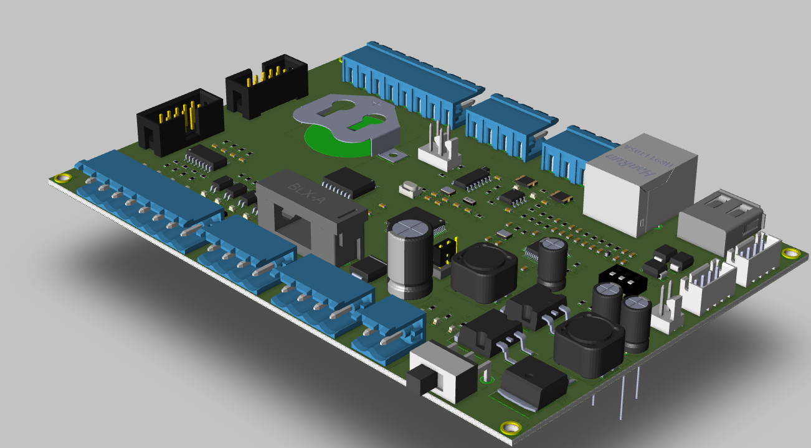
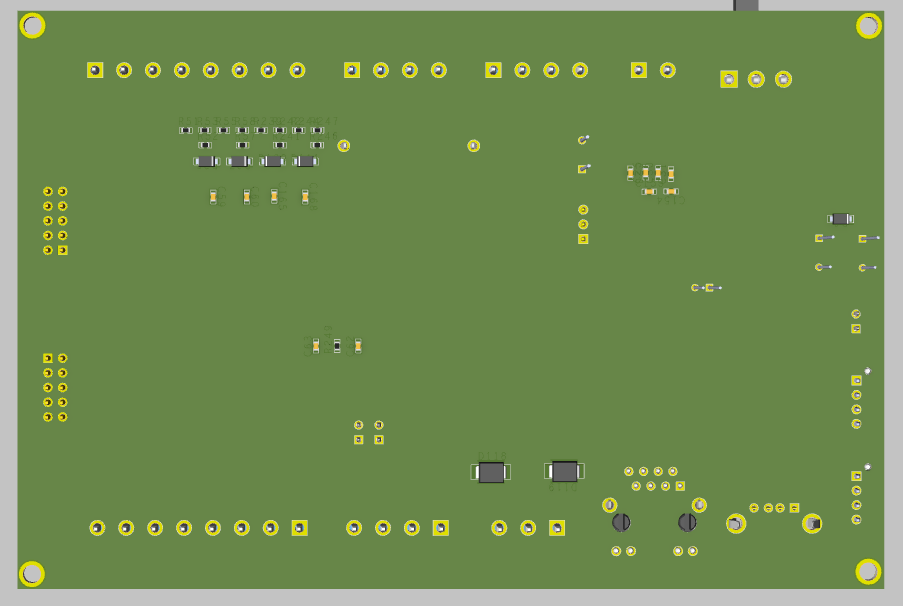
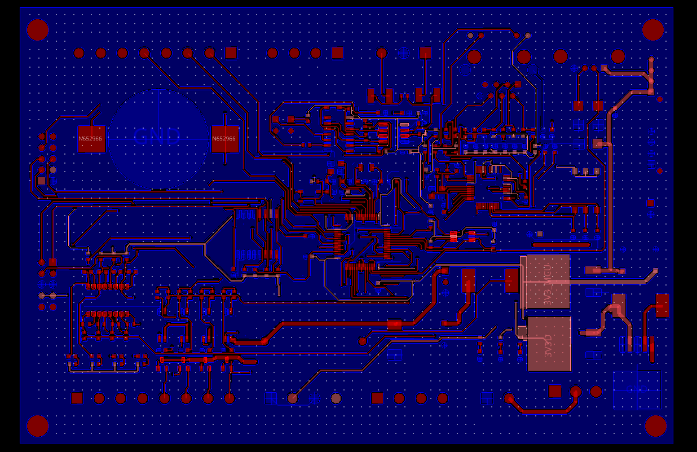
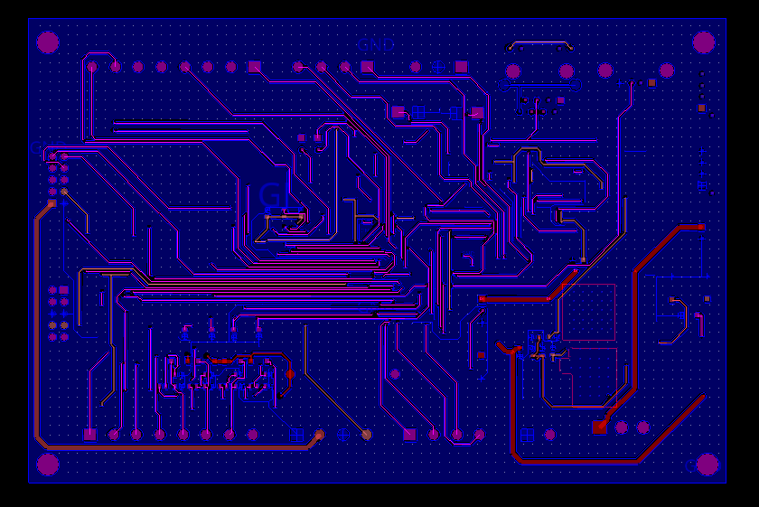

# 2-Layers STM32 Ethernet MiniPLC Board

🚀 **High-Speed Industrial MiniPLC Board** powered by **STM32** with **Ethernet & Industrial Interfaces**  
**This is an ongoing project and is expected to be completed in June 2025.**
## 📌 Overview
This project is a **2-layer industrial MiniPLC** designed with **STM32F411RET6**, featuring **Ethernet (W5500), industrial I/Os, RS485 communication, and ADC for sensor data acquisition**. The board is optimized for **real-time data logging, industrial automation, and IIoT applications**.

## ✨ Features
✅ **Processor:** STM32F411RET6 (Cortex-M4, 100MHz, 512KB Flash, 128KB RAM)  
✅ **Ethernet Connectivity:** W5500 SPI Ethernet Controller  
✅ **Industrial Communication Protocols:**  
   - **Modbus RTU (RS485), Modbus TCP/IP**  
   - **OPC-UA, MQTT for AIoT**  
✅ **I/O Interfaces:**  
   - **Isolated GPIOs (12V Input & Output)**  
   - **Analog Input (0-10V) & Analog Output (PWM, DAC)**  
✅ **Real-Time Clock:** DS3231 with battery backup  
✅ **Storage:** SD Card for data logging  
✅ **Power Supply:** 12V DC Input  

## 🛠️ Hardware Design
- **🖥️ PCB Design:** 2-layer board designed in **Allegro/Orcad v17.4**  
- **⚡ High-Speed Design:** Differential pairs for Ethernet, impedance matching  
- **🔧 Isolation:** Optocouplers for GPIOs, TVS diodes for surge protection  
- **📝 Schematics & Layout:** [View in Allegro/Orcad v17.4](#)  

## 💾 Firmware
- **🛠️ Developed using:** STM32CubeIDE, FreeRTOS  
- **🔗 Communication Stacks:**  
  - LWIP for Ethernet  
  - Modbus (RTU/TCP)  
  - MQTT for IIoT data exchange  

## 📡 Connectivity & Industrial IoT
- **🌐 Ethernet (W5500 SPI)**
- **📡 MQTT Broker Support (Node-RED, ThingsBoard)**
- **📊 Real-time monitoring via Web UI**
- **🔧 Edge Computing with Raspberry Pi for AI-based predictive maintenance** *(optional integration)*  

## 🚀 Getting Started
### 1️⃣ Hardware Setup
1. Power the board using **12V DC**.  
2. Connect **Ethernet, RS485, or Sensors** as needed.  
3. Connect to a Raspberry Pi 5 Expansion Board to analyze edge computing data from a database.
### 2️⃣ Firmware Flashing
1. Install **STM32CubeIDE**.  
2. Clone this repo:  
   ```bash
   git clone https://github.com/maixuancanh2003/4-Layers-STM32-Ethernet-MiniPLC-Board.git
   cd 4-Layers-STM32-Ethernet-MiniPLC-Board
   ```
3. Flash the firmware using **ST-Link** or DFU mode.

### 3️⃣ Testing Ethernet Connectivity
1. Connect board to a **LAN network**.
2. Use `ping` to test connectivity:  
   ```bash
   ping 192.168.1.100  # Default IP
   ```
3. Open **MQTT Dashboard** or **Modbus Poll** to test data exchange.

## 📸 Project Images
| View        | Image                             |
|-------------|-----------------------------------|
| **FrontLeft View**    |     |
| **Bottom View** |  |
| **Layout Top**    |     |
| **Layout Bottom** |  |

## 👨‍💻 Author & Contributions
Developed by **Mai Xuan Canh** 🚀  
📩 Contact: [canhmai.work@gmail.com](mailto:canhmai.work@gmail.com)  
📌 LinkedIn: [linkedin.com/in/maixuancanh2003](https://linkedin.com/in/maixuancanh2003)  

## 🌟 Support & Contributions
Feel free to fork this repo, submit pull requests, or raise issues! If you find this project useful, **please give it a ⭐️!**  

👉 **[GitHub Repo](https://github.com/maixuancanh2003/4-Layers-STM32-Ethernet-MiniPLC-Board)**  🚀  

## 🎯 Next Steps & Future Work
✅ **Enhance Web UI for real-time monitoring**  
✅ **Optimize power consumption for edge computing**  
✅ **Integrate AI/ML for predictive maintenance**  

---
